# firebase

NoSQL

누가 작성한 todo를 작성하자


1. 프로제그 추가


2. db 만들기


html 파일에 installation복붙


대신, Firebase v5.8.0로 한다


문서 보자


여기서 웹 시작하기

그럼 


이걸 복붙하겠다.


채워넣은 상황.


여기서 var-> const했다.편의상

문서 참조 : https://github.com/vuejs/vuefire/tree/v1


로그인 설정


### firebaseui-web [링쿠](<https://github.com/firebase/firebaseui-web>)

install CDN 복사 (v 관계 무)

```html
<script src="https://cdn.firebase.com/libs/firebaseui/3.6.0/firebaseui.js"></script>
<link type="text/css" rel="stylesheet" href="https://cdn.firebase.com/libs/firebaseui/3.6.0/firebaseui.css" />
```

@[링크](<https://github.com/firebase/firebaseui-web#starting-the-sign-in-flow>)

```js
var ui = new firebaseui.auth.AuthUI(firebase.auth());
```


만들어놓은 object 사용하기위해 메서드 만듦

```js
initUi: function() {
    ui.start('#firebaseui-auth-container',{
        signInoptions: [
            firebase.auth.EmailAuthProvider/PROVIDER_ID
        ],
        callbacks: {
            signinSuccessWithAuthResult: (authResult, redirectUrl) => {
                this.currentUser.uid = authResult.user.uid
                this.currentUser.email = authResult.user.email
                this.currentUser.username = authResult.user.username
                return false
            }
        }
    })
},
```

callback 을 arrowfunction 써야지만 this 가 vue로 된다.

```html
    <style>
        .chat {
            border: 1px solid seashell;
            background-color: darkorange;
        }
        .my-chat {
            margin-left: auto;
            background-color: darkblue;
        }
    </style>
```


```js
                <li v-for="message in messages" 
                :class="{'chat':true, 'my-chat': currentUser.username === messge.username}">
```

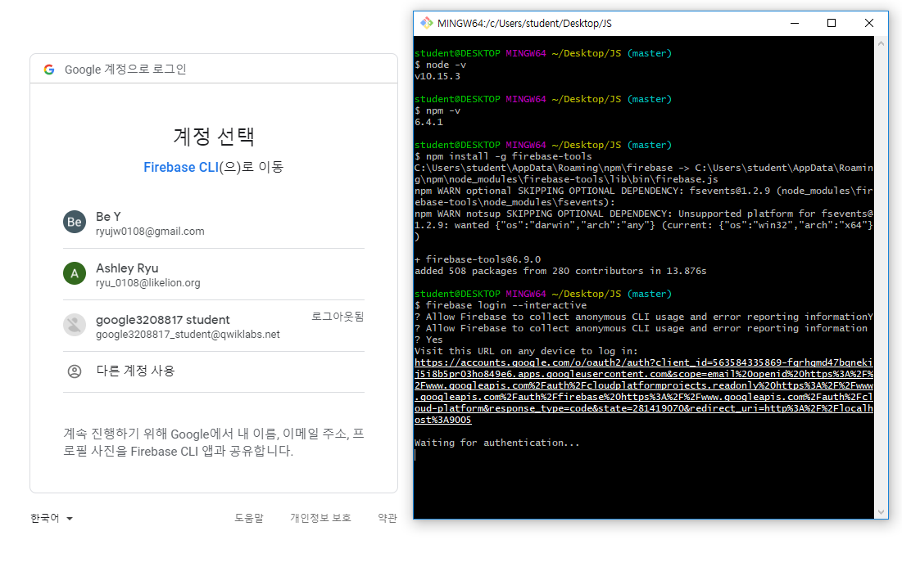

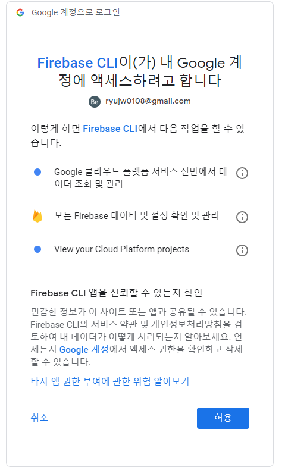

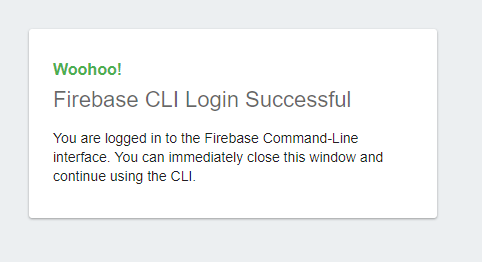

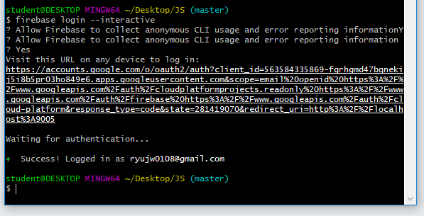

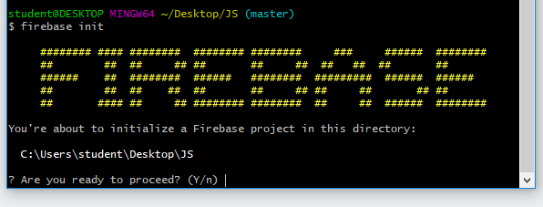

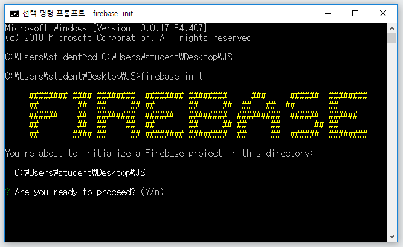

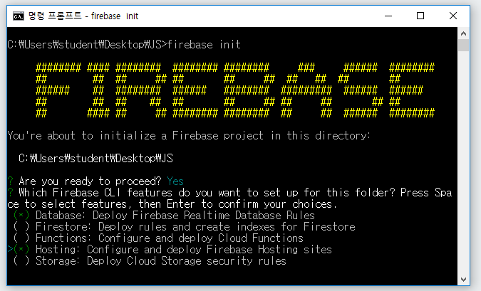

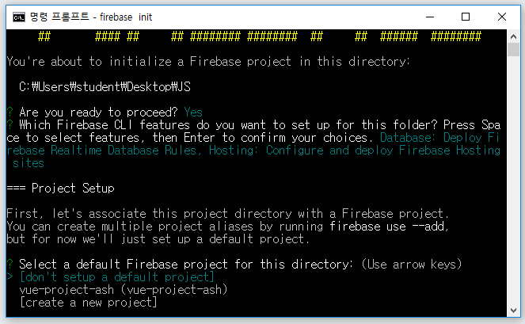

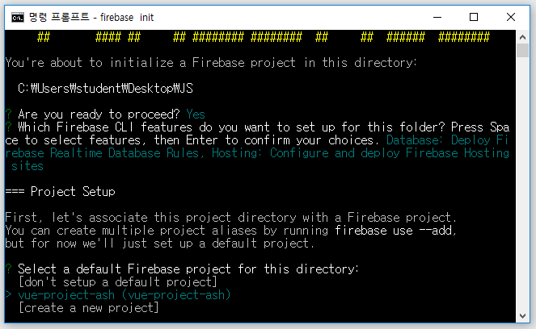

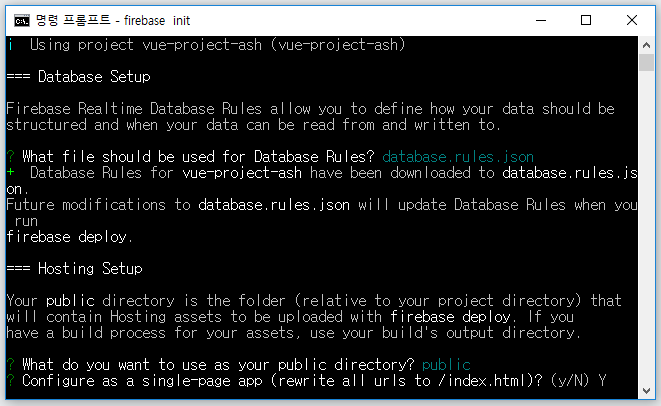

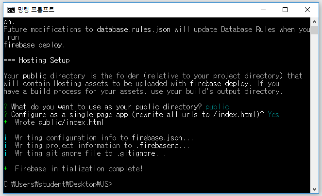

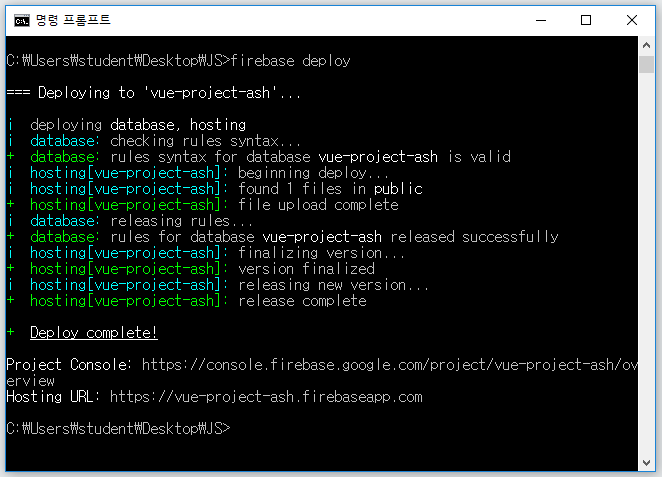


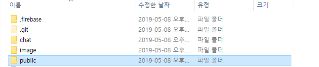

public - index.html을 내 index.html로 바꾼다

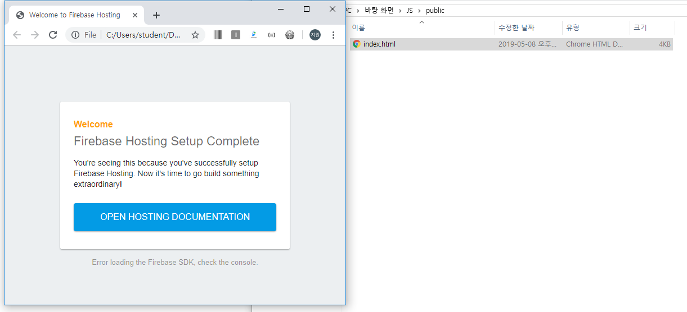

지금 html.index는 이것

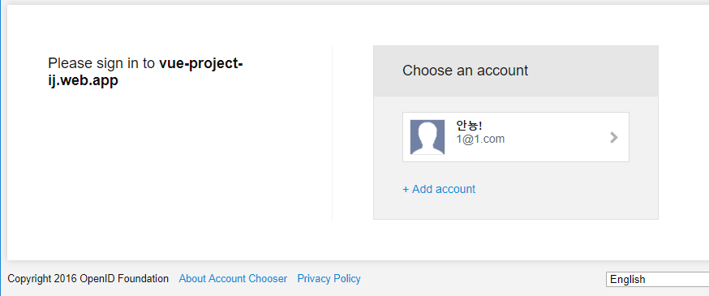

끝!

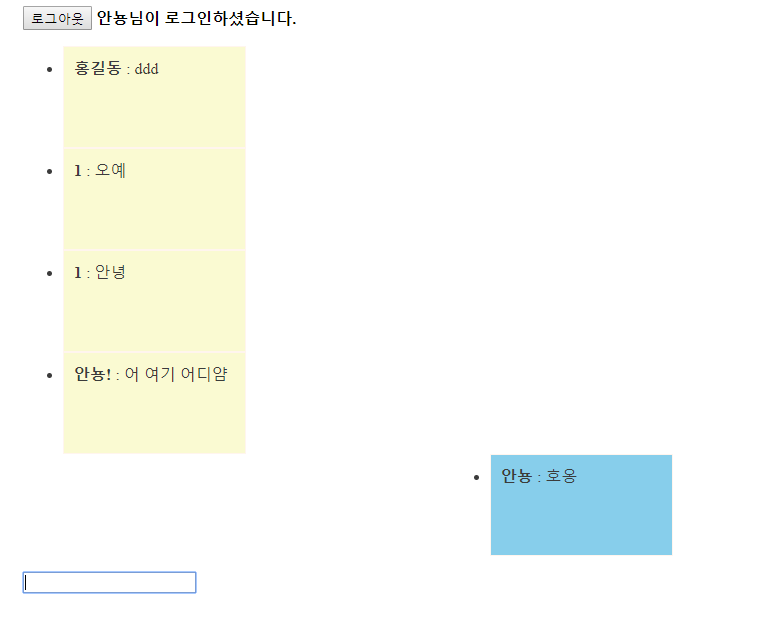

와웅